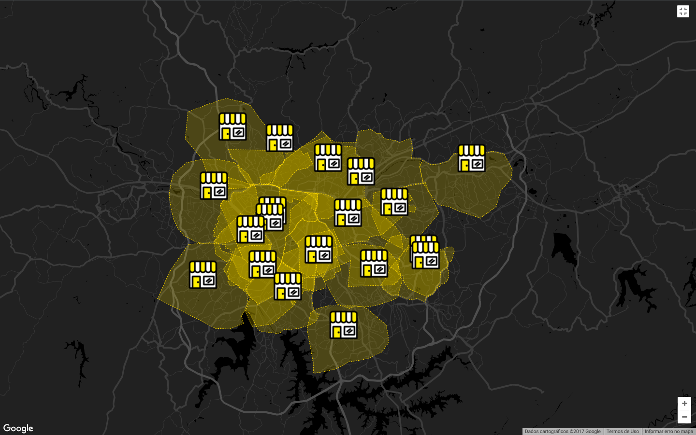

# Desafio de Backend

No Zé, encontramos o melhor parceiro para entregar as bebidas aos nossos consumidores, oferecendo o melhor e mais rápido serviço de entrega de bebidas.
Para isso nossos computadores lidam o tempo todo com objetos [GIS](https://en.wikipedia.org/wiki/Geographic_information_system).

Quando programamos, nós tentamos seguir uma gama de melhores práticas e padrões de projeto (que você pode ler sobre em livros como Código Limpo, Arquitetura Limpa, O Programador Pragmático, Domain-Driven Design, Microservice Patterns, etc...).
Já que escrever **um bom código é inegociável** no nosso dia a dia, nós esperamos que as pessoas que queiram entrar no nosso time pensem da mesma maneira. Este teste foi criado para encontrar esses programadores.

## 1. O que queremos que você faça

Nós esperamos que você desenvolva um serviço que disponibilize uma API REST ou GraphQL que implemente essas funcionalidades e requisitos técnicos:

### 1.1. Criar um parceiro:
Salvar no banco de dados **todas** as seguintes informações representadas por este JSON junto com as regras subsequentes:
```json
{
  "id": 1, 
  "tradingName": "Adega da Cerveja - Pinheiros",
  "ownerName": "Zé da Silva",
  "document": "1432132123891/0001",
  "coverageArea": { 
    "type": "MultiPolygon", 
    "coordinates": [
      [[[30, 20], [45, 40], [10, 40], [30, 20]]], 
      [[[15, 5], [40, 10], [10, 20], [5, 10], [15, 5]]]
    ]
  },
  "address": { 
    "type": "Point",
    "coordinates": [-46.57421, -21.785741]
  }
}
```

1. O campo `address` (endereço em inglês) segue o formato `GeoJSON Point` (https://en.wikipedia.org/wiki/GeoJSON);
2. o campo `coverageArea` (área de cobertura em inglês) segue o formato `GeoJSON MultiPolygon` (https://en.wikipedia.org/wiki/GeoJSON);
3. O campo `document` deve ser único entre os parceiros;
4. O campo `id` deve ser único entre os parceiros, mas não necessariamente um número inteiro;

Você pode usar esse arquivo [JSON](parceiros.json) com centenas de informações de parceiros que geramos para você testar o seu serviço — **não** esperamos que estes parceiros estejam pré carregados em sua base de dados.
Abaixo, você pode ver como estes parceiros são representados em um mapa:


### 1.2. Carregar parceiro pelo `id`:
Retornar um parceiro específico baseado no seu campo `id` com todos os campos apresentados acima.

### 1.3. Buscar parceiro:
Dada uma localização pelo usuário da API (coordenadas `long` e `lat`), procure o parceiro que esteja **mais próximo** e **que cuja área de cobertura inclua** a localização.

# Como Executar

1. **Gerar a imagem com Docker**  
   ```bash
   docker build -t zeDeliveryImage .
2. **Iniciar o Container com a Imagem Gerada**

   ```bash
   docker run -d -p 5432:5432 zeDeliveryImage

3. Você pode utilizar o Postman ou outro cliente HTTP para enviar o arquivo parceiros.json para o endpoint `/api/parceiro/batch`. Isso carregará os parceiros de teste no banco de dados.

# Endpoints

| Método | Endpoint                             | Descrição                                                  |
|--------|--------------------------------------|-----------------------------------------------------------|
| GET    | `/api/parceiro/{id}`                | Retorna os detalhes de um parceiro com base no ID fornecido. |
| GET    | `/api/parceiro/{longitude}/{latitude}` | Retorna o parceiro mais próximo às coordenadas fornecidas. |
| POST   | `/api/parceiro/batch`               | Carrega parceiros em batch enviando um arquivo JSON.       |

